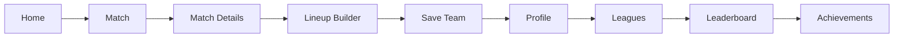
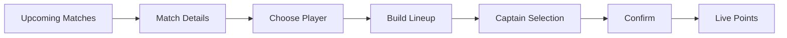
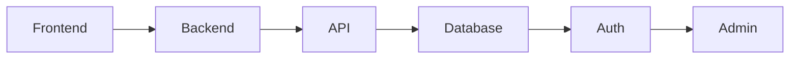
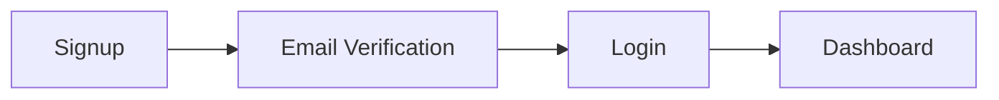

# Client Flow Diagrams

Here are the flow diagrams for the application based on the provided requirements.

## A) User Journey Flow (End-To-End)

## B) Gameplay Flow

## C) System Architecture Flow

## D) Authentication Flow

