# User Flow Diagrams
## Fantasy Matchday - Primary User Journeys

**Project:** Fantasy Matchday  
**Milestone:** 1 - Requirements Gathering & Wireframing  
**Document:** User Flow Diagrams  
**Date:** November 23, 2025

---

## Overview

This document outlines all primary user journeys for Fantasy Matchday, including registration, match selection, lineup creation, leaderboard viewing, and league management. Each flow is designed to be simple, intuitive, and optimized for both mobile and desktop experiences.

---

## 1. Registration & Onboarding Flow

### 1.1 New User Registration (Email/Password)

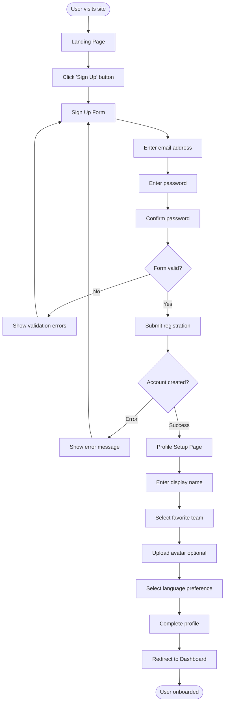

**Key Steps:**
1. User lands on homepage
2. Clicks "Sign Up" button
3. Fills registration form (email, password, confirm password)
4. System validates input
5. Account created in Firebase
6. User completes profile setup (name, team, avatar, language)
7. Redirected to dashboard

**Success Criteria:**
- Registration completes in <2 minutes
- Clear error messages for validation
- Profile setup is intuitive
- Language preference applies immediately

---

### 1.2 Social Login (Google OAuth)

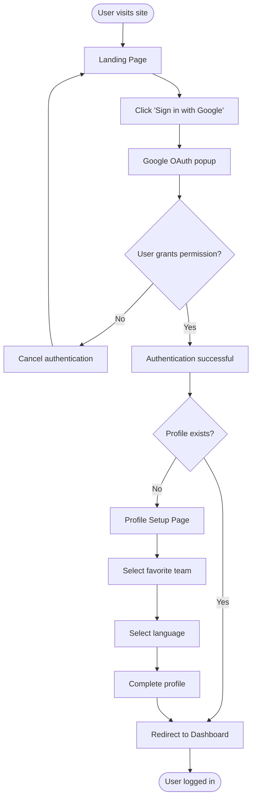

**Key Steps:**
1. User clicks "Sign in with Google"
2. Google OAuth popup appears
3. User grants permission
4. System checks if profile exists
5. If new user, complete profile setup
6. Redirected to dashboard

**Success Criteria:**
- OAuth completes in <30 seconds
- Seamless profile creation for new users
- Existing users skip profile setup

---

## 2. Match Selection Flow

### 2.1 Browse and Select Match

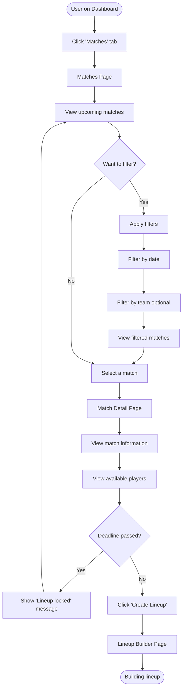

**Key Steps:**
1. User navigates to Matches page
2. Views list of upcoming matches
3. Optionally applies filters (date, team)
4. Selects a match
5. Views match details and available players
6. Checks if deadline has passed
7. Clicks "Create Lineup" to start building

**Success Criteria:**
- Matches load in <1 second
- Filters work instantly
- Match details are comprehensive
- Deadline status is clear

---

## 3. Lineup Creation Flow

### 3.1 Build Lineup (Desktop - Drag & Drop)

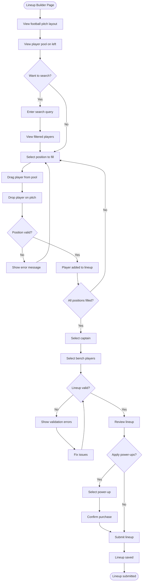

**Key Steps:**
1. User views pitch layout and player pool
2. Optionally searches for specific players
3. Drags players from pool to pitch positions
4. System validates each placement
5. Fills all 11 starting positions
6. Selects captain (2x points)
7. Selects 4 bench players
8. System validates entire lineup
9. Optionally applies power-ups
10. Submits lineup

**Success Criteria:**
- Drag-and-drop is smooth (60fps)
- Validation is instant
- Clear error messages
- Auto-save every 30 seconds
- Formation constraints enforced

---

### 3.2 Build Lineup (Mobile - Position Selection)

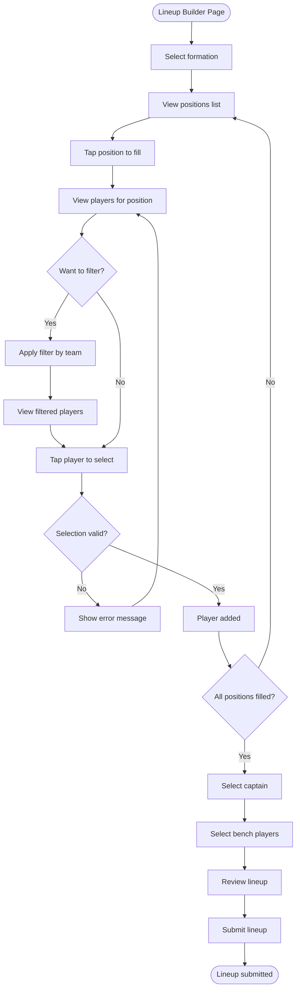

**Key Steps:**
1. User selects formation (4-4-2, 4-3-3, etc.)
2. Taps position to fill (GK, DEF, MID, FWD)
3. Views list of players for that position
4. Optionally filters by team
5. Taps player to select
6. System validates selection
7. Repeats for all positions
8. Selects captain and bench
9. Reviews and submits

**Success Criteria:**
- Touch-optimized interface
- Fast position switching
- Clear visual feedback
- Easy captain selection
- One-thumb operation

---

## 4. Live Match & Points Tracking Flow

### 4.1 Track Live Match Points

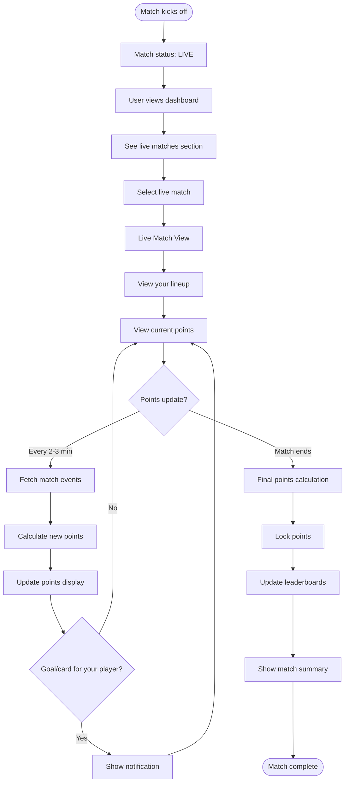

**Key Steps:**
1. Match starts, status changes to LIVE
2. User views dashboard or live match page
3. Sees their lineup with current points
4. Points update every 2-3 minutes
5. System fetches match events from API
6. Calculates points based on events
7. Updates display in real-time
8. Shows notifications for goals/cards
9. Match ends, final calculation
10. Points locked, leaderboards updated

**Success Criteria:**
- Real-time updates without refresh
- Notifications for key events
- Clear points breakdown
- Smooth animations
- Final points lock correctly

---

## 5. Leaderboard Viewing Flow

### 5.1 View Global Leaderboard

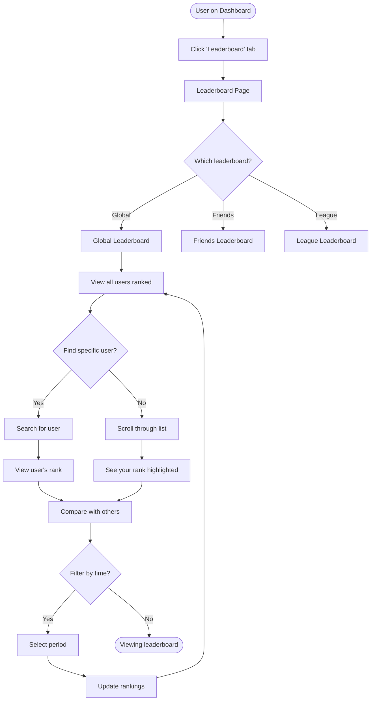

**Key Steps:**
1. User navigates to Leaderboard page
2. Selects tab (Global/Friends/League)
3. Views ranked list of users
4. Optionally searches for specific user
5. Sees own rank highlighted
6. Compares stats with others
7. Optionally filters by time period

**Success Criteria:**
- Leaderboard loads in <1 second
- User's rank is highlighted
- Search works instantly
- Position changes show arrows
- Pagination for large lists

---

## 6. League Management Flow

### 6.1 Create Private League

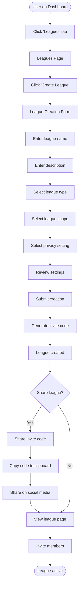

**Key Steps:**
1. User navigates to Leagues page
2. Clicks "Create League"
3. Fills league creation form:
   - League name
   - Description
   - Type (standard/head-to-head/weekly/monthly)
   - Scope (single match/weekly/monthly/season)
   - Privacy (public/private/invite-only)
4. Reviews settings
5. Submits creation
6. System generates unique invite code
7. User shares code with friends
8. League is active

**Success Criteria:**
- League creation in <1 minute
- Unique invite codes generated
- Easy sharing options
- Clear league settings

---

### 6.2 Join League

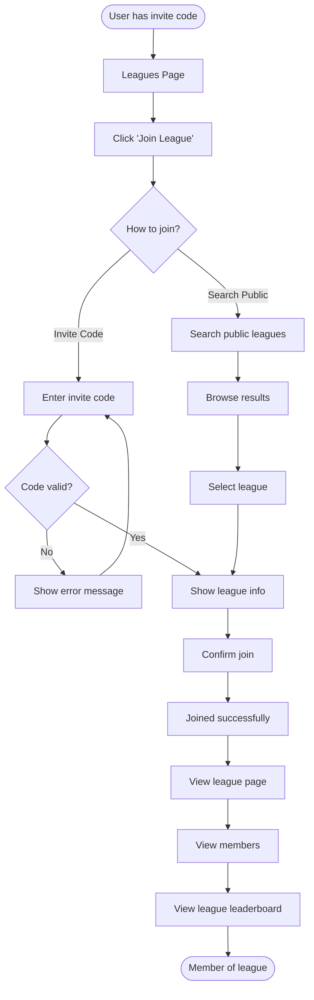

**Key Steps:**
1. User navigates to Leagues page
2. Clicks "Join League"
3. Chooses method:
   - Enter invite code
   - Search public leagues
4. System validates code or shows search results
5. User confirms join
6. Added to league
7. Views league page and leaderboard

**Success Criteria:**
- Join process in <30 seconds
- Clear validation messages
- Public league search works well
- Immediate access to league features

---

## 7. Credit & Power-Up Flow

### 7.1 Purchase and Use Power-Up

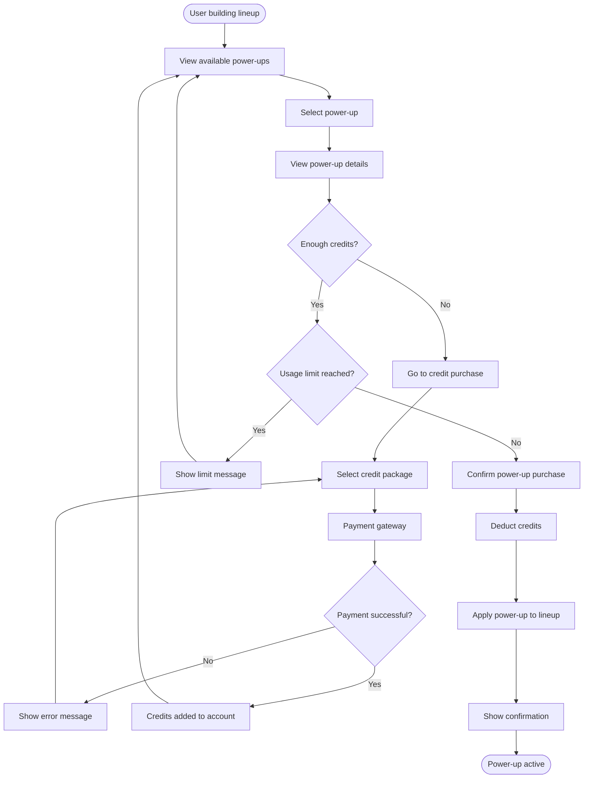

**Key Steps:**
1. User views available power-ups
2. Selects desired power-up
3. Views details and cost
4. System checks credit balance
5. If insufficient, user purchases credits
6. System checks usage limits
7. User confirms purchase
8. Credits deducted
9. Power-up applied to lineup
10. Confirmation shown

**Success Criteria:**
- Clear power-up descriptions
- Secure payment processing
- Usage limits enforced
- Immediate power-up application
- Transaction history tracked

---

## 8. Notification Flow

### 8.1 Receive and View Notifications

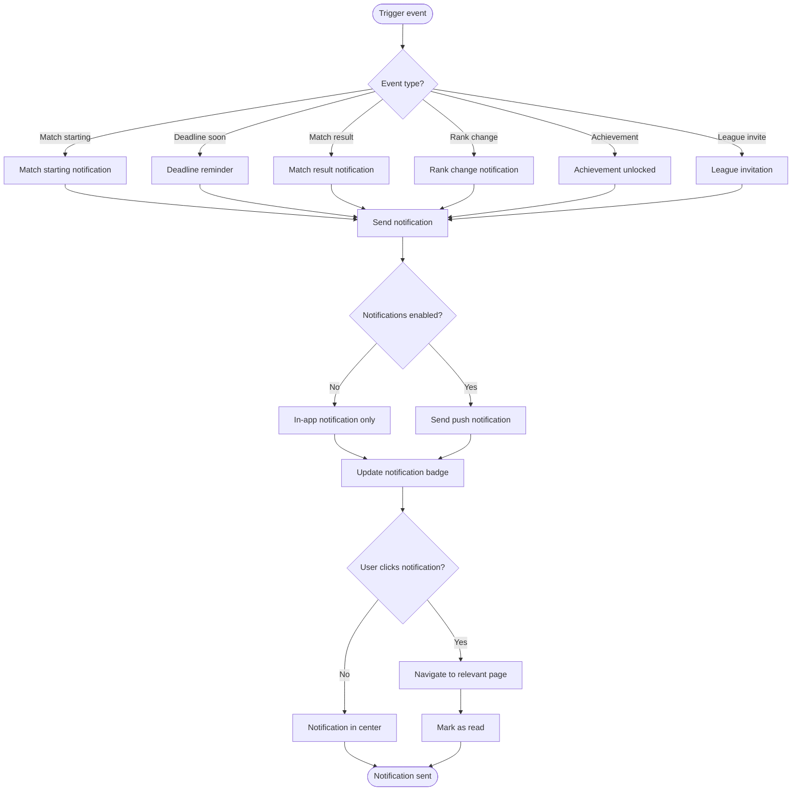

**Key Steps:**
1. Event triggers notification
2. System determines notification type
3. Checks user preferences
4. Sends push notification (if enabled)
5. Updates in-app notification badge
6. User clicks notification
7. Navigates to relevant page
8. Notification marked as read

**Success Criteria:**
- Notifications send instantly
- Respect user preferences
- Clear notification content
- Correct navigation on click
- Badge counts update

---

## Flow Summary

### Key User Journeys Covered

1. **Registration & Onboarding:** Email/password and Google OAuth flows
2. **Match Selection:** Browse, filter, and select matches
3. **Lineup Creation:** Desktop (drag-drop) and mobile (position selection)
4. **Live Match Tracking:** Real-time points updates and notifications
5. **Leaderboard Viewing:** Global, friends, and league leaderboards
6. **League Management:** Create and join leagues
7. **Power-Ups:** Purchase credits and use power-ups
8. **Notifications:** Receive and interact with notifications

### Design Principles Applied

- **Simplicity:** Minimal steps to accomplish tasks
- **Clarity:** Clear feedback at each step
- **Flexibility:** Multiple paths to achieve goals
- **Error Handling:** Graceful error messages and recovery
- **Mobile-First:** Optimized for touch interactions
- **Real-Time:** Live updates without page refresh

---

**Document Version:** 1.0  
**Last Updated:** November 23, 2025  
**Status:** Complete
